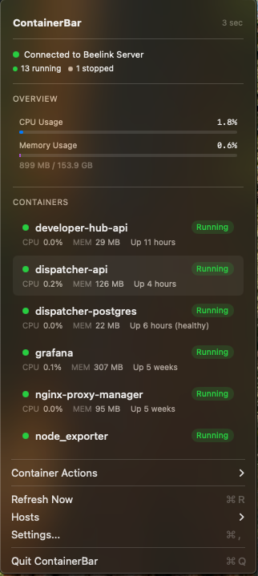

# ContainerBar

A lightweight macOS menu bar application for Docker container monitoring and management.



## Overview

ContainerBar provides instant access to Docker container status directly from your macOS menu bar. Monitor running containers, view real-time CPU and memory metrics, and perform quick management actions—all without opening a browser or terminal.

Works seamlessly with **Docker Desktop** on your local machine or connects to **remote Docker hosts** via SSH.

## Why ContainerBar?

This project was inspired by [Peter Steinberger's](https://github.com/steipete) excellent [CodexBar](https://github.com/steipete/CodexBar) application. After seeing CodexBar in action, I thought: *what if I could do something similar for my Docker containers on my homelab server?* Instead of constantly opening Portainer or SSH-ing into my server just to check container status, I wanted that information right in my menu bar — one click away.

ContainerBar was vibe coded using **Claude Opus 4.5**, turning that idea into a fully functional macOS app.

## Features

- **Menu Bar Access**: View container status at a glance from your menu bar
- **Real-time Metrics**: Monitor CPU, memory usage across all containers
- **Quick Actions**: Start, stop, restart, view logs, and remove containers with one click
- **Multiple Hosts**: Connect to local Docker Desktop or remote Docker hosts via SSH
- **Container Details**: View image, ports, network, and resource usage per container
- **Native Experience**: Built with Swift and SwiftUI for a true macOS-native feel

## Requirements

- macOS 14 (Sonoma) or later
- Docker Desktop (for local containers) or a remote Docker host accessible via SSH

## Installation

### Homebrew (Recommended)

```bash
brew tap michaeltookes/tap
brew install --cask containerbar
```

### Direct Download

Download the latest release from the [Releases page](https://github.com/michaeltookes/ContainerBar/releases), open the DMG, and drag ContainerBar to your Applications folder.

### From Source

```bash
# Clone the repository
git clone https://github.com/michaeltookes/ContainerBar.git
cd ContainerBar

# Build the release
./scripts/build-release.sh

# The app will be at dist/ContainerBar.app
```

## Getting Started

For a complete walkthrough with screenshots, see the **[Getting Started Guide](docs/GETTING_STARTED.md)**.

### Quick Start

1. Launch ContainerBar — the icon appears in your menu bar
2. If Docker Desktop is running, ContainerBar connects automatically
3. Click the menu bar icon to see your containers

### Adding a Remote Host

1. Click the ContainerBar icon in your menu bar
2. Hover over **Hosts** → click **Add Host...**
3. Enter a name, hostname/IP, and SSH user
4. Click **Add**

> **Note**: SSH key-based authentication must be configured for remote connections.

### Keyboard Shortcuts

| Shortcut | Action |
|----------|--------|
| `Cmd + R` | Refresh container list |
| `Cmd + ,` | Open Settings |
| `Cmd + Q` | Quit ContainerBar |

You can also set a custom global hotkey in Settings.

## Development

### Prerequisites

- Xcode 15.0+ (for Swift 6.0)
- Swift 6.0+

### Building

```bash
# Development build
swift build

# Release build
swift build -c release

# Run tests
swift test
```

### Project Structure

```
ContainerBar/
├── Package.swift                       # Swift Package Manager configuration
├── Sources/      
│   ├── ContainerBar/                   # macOS application
│   │   ├── ContainerBarApp.swift       # App entry point
│   │   ├── AppDelegate.swift           # Application delegate
│   │   ├── StatusItemController.swift  # Menu bar management
│   │   ├── Stores/                     # State management
│   │   └── Views/                      # SwiftUI views
│   └── ContainerBarCore/               # Business logic library
│       ├── Models/                     # Data structures
│       ├── API/                        # Docker API client
│       └── Services/                   # Connection services
├── Tests/                              # Unit tests
├── Distribution/                       # Release assets (icons, entitlements)
├── scripts/                            # Build and release scripts
├── docs/
│   ├── GETTING_STARTED.md              # User guide
│   └── images/                         # Documentation screenshots
└── .claude/agents/                     # Claude Code agent documentation
    ├── DESIGN_DOCUMENT.md              # Technical specification
    └── PROJECT_ORCHESTRATION.md        # Project orchestration guide
```

## Contributing

Contributions are welcome! Please read the design document at `.claude/agents/DESIGN_DOCUMENT.md` before submitting changes.

1. Fork the repository
2. Create a feature branch
3. Make your changes
4. Run tests (`swift test`)
5. Submit a pull request

## License

[License to be determined]

## Acknowledgments

- Inspired by [CodexBar](https://github.com/steipete/CodexBar) by [Peter Steinberger](https://github.com/steipete)
- Vibe coded with [Claude Opus 4.5](https://www.anthropic.com/claude) by Anthropic
- Built with Swift 6 and modern Apple frameworks
- Uses [KeyboardShortcuts](https://github.com/sindresorhus/KeyboardShortcuts) for global hotkey support
- Uses [Sparkle](https://sparkle-project.org/) for automatic updates
