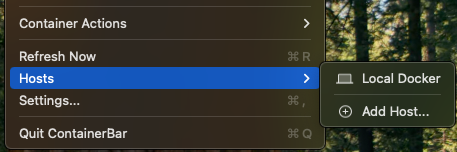
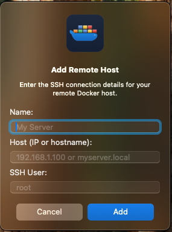
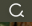
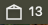
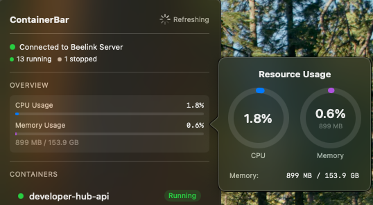
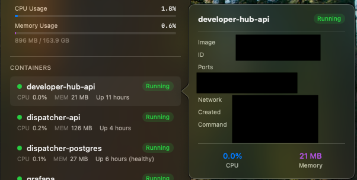
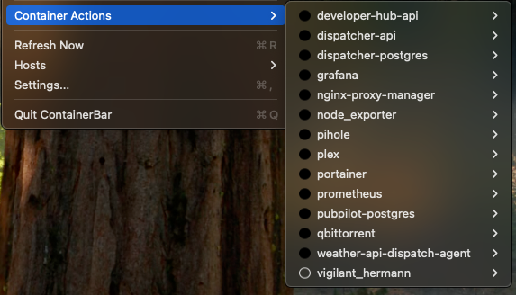
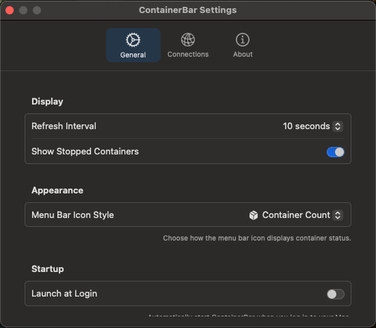

# Getting Started with ContainerBar

ContainerBar is a lightweight macOS menu bar application for monitoring and managing Docker and Podman containers. It works with Docker Desktop or Podman on your local machine, or connects to remote Docker/Podman hosts via SSH.

## Table of Contents

- [Requirements](#requirements)
- [Installation](#installation)
- [Connecting to Docker or Podman](#connecting-to-docker-or-podman)
  - [Local Docker (Docker Desktop)](#local-docker-docker-desktop)
  - [Local Podman](#local-podman)
  - [Adding a Remote Host](#adding-a-remote-host)
- [Using ContainerBar](#using-containerbar)
  - [Menu Bar Icon](#menu-bar-icon)
  - [Viewing Containers](#viewing-containers)
  - [Resource Usage](#resource-usage)
  - [Container Details](#container-details)
  - [Container Actions](#container-actions)
- [Settings](#settings)

---

## Requirements

- macOS 14.0 (Sonoma) or later
- Docker Desktop or Podman (for local containers), or a remote Docker/Podman host accessible via SSH

## Installation

1. Download the latest release from the [Releases page](https://github.com/michaeltookes/ContainerBar/releases)
2. Open the DMG file and drag ContainerBar to your Applications folder
3. Launch ContainerBar from Applications
4. The ContainerBar icon will appear in your menu bar

---

## Connecting to Docker or Podman

### Local Docker (Docker Desktop)

ContainerBar automatically connects to your local Docker Desktop installation. Simply ensure Docker Desktop is running, and ContainerBar will detect it using the default Unix socket (`/var/run/docker.sock`).

### Local Podman

ContainerBar also supports Podman. When adding a local Podman host:

1. Open **Settings** > **Connections**
2. Click **Add Host**
3. Select **Podman** as the runtime
4. The socket path defaults to `~/.local/share/containers/podman/machine/podman.sock`
5. Click **Add**

ContainerBar automatically uses the correct socket path and API compatibility layer for Podman.

### Adding a Remote Host

To monitor containers on a remote server:

1. Click the ContainerBar icon in your menu bar
2. Hover over **Hosts** to see the submenu
3. Click **Add Host...**

4. Select the **Runtime** (Docker or Podman)
5. Fill in your server details:
   - **Name**: A friendly name for this host (e.g., "My Server")
   - **Host**: The IP address or hostname (e.g., `192.168.1.100` or `myserver.local`)
   - **SSH User**: The SSH username (defaults to `root`)

6. Click **Add** to save the host

The remote socket path is set automatically based on the selected runtime:
- **Docker**: `/var/run/docker.sock`
- **Podman**: `/run/user/1000/podman/podman.sock`

ContainerBar connects via SSH tunnel, so ensure:
- SSH is enabled on the remote host
- Your SSH keys are configured for passwordless authentication
- Docker or Podman is installed and running on the remote host

---

## Using ContainerBar

### Menu Bar Icon

Once connected, ContainerBar displays a container icon with the number of running containers:

| Icon | Meaning |
|------|---------|
|  | Refreshing data from Docker host |
|  | Connected - showing 13 running containers |

### Viewing Containers

Click the menu bar icon to see the full dashboard:

The dashboard shows:
- **Connection status**: Green indicator when connected, with the host name
- **Container count**: Running, stopped, and paused containers at a glance
- **Overview**: Total CPU and memory usage across all containers
- **Containers list**: Each container with its name, status, CPU %, memory usage, and uptime

### Resource Usage

Hover over the Overview section to see a detailed resource usage popover with gauge charts:

This shows:
- **CPU Usage**: Current CPU utilization percentage
- **Memory Usage**: Current memory consumption with total available

### Container Details

Click on any container in the list to see more details:

The detail popover shows:
- Container name and status
- Image name
- Container ID
- Port mappings
- Network mode
- Creation date
- Command being run
- CPU and memory usage

### Container Actions

To manage individual containers, hover over **Container Actions** in the menu:

Each container has a submenu with available actions:
- **View Logs**: Open a log viewer window for the container
- **Stop**: Stop a running container
- **Restart**: Restart a running container
- **Start**: Start a stopped container
- **Copy Container ID**: Copy the container ID to clipboard
- **Remove**: Delete the container (with confirmation)

The colored dot indicates status:
- Green filled circle: Running
- Gray hollow circle: Stopped

---

## Settings

Access settings by clicking **Settings...** in the menu (or press `Cmd + ,`):

### General Settings

**Display**
- **Refresh Interval**: How often ContainerBar fetches new data (5 seconds to 5 minutes, or manual only)
- **Show Stopped Containers**: Toggle visibility of stopped containers in the list

**Appearance**
- **Menu Bar Icon Style**: Choose how the menu bar icon displays:
  - *Container Count*: Shows the number of running containers
  - *CPU + Memory Bars*: Shows resource usage bars
  - *Health Indicator*: Shows a simple health dot

**Startup**
- **Launch at Login**: Automatically start ContainerBar when you log in

### Connections

The Connections tab lets you manage your Docker hosts:
- View all configured hosts
- Test connections
- Set the active host
- Add or remove hosts

### About

View app version information and helpful links.

---

## Keyboard Shortcuts

| Shortcut | Action |
|----------|--------|
| `Cmd + R` | Refresh container data |
| `Cmd + ,` | Open Settings |
| `Cmd + Q` | Quit ContainerBar |

You can also set a custom global hotkey in Settings to quickly toggle the menu from anywhere.

---

## Troubleshooting

**ContainerBar shows "Not Connected"**
- Ensure Docker Desktop or Podman is running (for local connections)
- For remote hosts, verify SSH connectivity and that Docker/Podman is running
- Verify the correct runtime is selected in host configuration

**Cannot connect to remote host**
- Verify SSH keys are set up for passwordless authentication
- Check that Docker or Podman is installed and the daemon is running
- Ensure port 22 (SSH) is accessible
- For Podman: ensure the Podman socket is enabled (`systemctl --user enable --now podman.socket`)

**Container actions not working**
- Some actions require the container to be in a specific state (e.g., can't stop an already stopped container)
- Check Docker permissions on the host

---

## Need Help?

- [Report an issue](https://github.com/michaeltookes/ContainerBar/issues)
- [View the source code](https://github.com/michaeltookes/ContainerBar)
